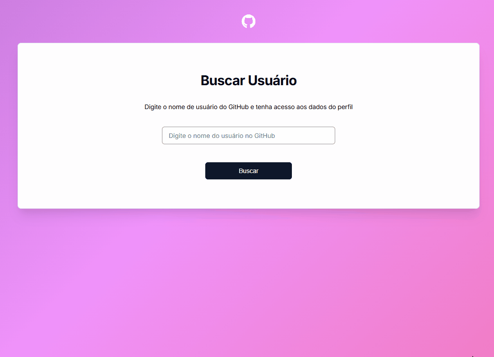

# Visualizador de Perfil do GitHub



## Acesse o Projeto Online

[Clique aqui para acessar o Visualizador de Perfil do GitHub no GitHub Pages](https://seu-usuario.github.io/visualizador-perfil-github/)


## Descrição

O Visualizador de Perfil do GitHub é uma aplicação web desenvolvida em JavaScript puro, HTML e CSS, que permite buscar e visualizar informações detalhadas de qualquer usuário do GitHub de forma rápida e intuitiva. O projeto foi criado para consolidar conhecimentos em manipulação de DOM, consumo de APIs e boas práticas de desenvolvimento front-end.

Essa é uma versão atualizada de um projeto já desenvolvido antes no curso de Desenvolvimento Web Fullstack - DevQuest.

## Funcionalidades

- Busca de usuários do GitHub pelo nome de usuário
- Exibição de informações do perfil: avatar, nome, bio, localização, seguidores, seguindo, repositórios públicos, etc.
- Listagem dos principais repositórios do usuário
- Feedback visual de carregamento durante a busca
- Mensagens de erro para usuário não encontrado ou problemas de conexão
- Busca pode ser feita ao clicar no botão ou pressionar Enter
- Layout responsivo para diferentes tamanhos de tela

## Tecnologias Utilizadas

- HTML5
- CSS3 (incluindo animações e responsividade)
- JavaScript (ES6+)
- Consumo da API pública do GitHub

## Estrutura do Projeto

```
visualizador-perfil-github/
│
├── index.html
├── README.md
└── src/
	├── css/
	│   ├── animations.css
	│   ├── reset.css
	│   ├── responsive.css
	│   └── styles.css
	└── js/
		├── index.js
		└── modules/
			├── githubApi.js
			└── profileView.js
```

## Como Usar

1. Clone este repositório:
   ```bash
   git clone <url-do-repositorio>
   ```
2. Abra o arquivo `index.html` em seu navegador preferido.
3. Digite o nome de usuário do GitHub que deseja pesquisar e pressione Enter ou clique no botão de busca.
4. Visualize as informações do perfil e os repositórios do usuário.

## Observações

- O projeto utiliza apenas recursos do front-end, sem backend.
- O consumo da API do GitHub está sujeito a limites de requisições não autenticadas.
- Para customizações, edite os arquivos em `src/css` e `src/js`.

## Aprendizados e Objetivos

- Prática de manipulação de DOM e eventos
- Consumo de APIs REST com JavaScript
- Modularização do código JS
- Estilização responsiva e animações CSS

## Contribuição

Contribuições são bem-vindas! Sinta-se à vontade para abrir issues ou pull requests.

## Licença

Este projeto está sob a licença MIT.